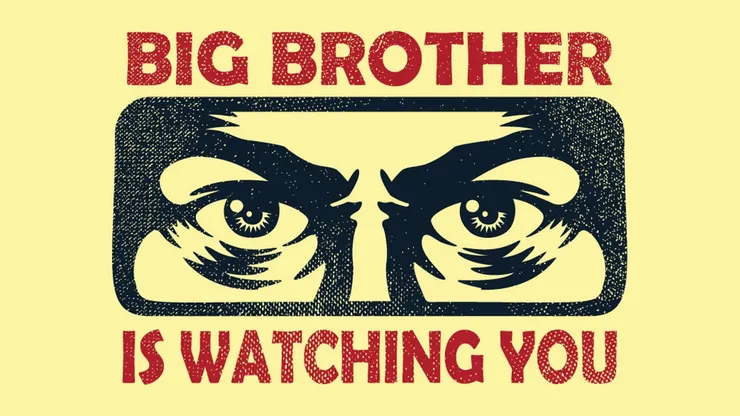
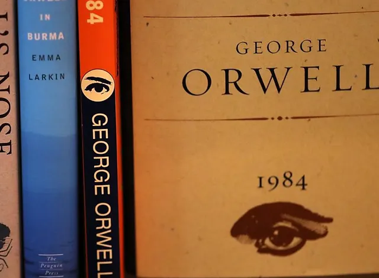

> Privacy is a fundamental right that is being threatened by the digital age. In this post, I will share with you what I learn after X was banned in Brazil and what you should do in these cases.



Topic to be covered in this article:

1. Why you should care about your privacy on-line
2. The basics: passwords and 2FA
3. You should buy a VPN
4. Where should you search? Search engines
5. Navigate safely with good browsers
6. Private e-mails
7. Talk safely with your friends
8. Social media: why am I using Nostr

<br/>


## 1. Why you should care about your privacy on-line.

Nowadays everything is too comfortable: you have all your files in a cloud and you can access everything with your phone or with your browser.
You have all your friends in the palm of your hands. You have access to all the knowledge of the _entire history of humanity in seconds_.

But with all this comfort come also a very threatener fact: your privacy is in danger, and you probably even don't know why.

> "But why should I care?"

I really do not think we are close to 1984, a dystopic world written by George Orwell (which I really recomend you to read). But I will cite some facts to make you think:


1. Google has access to all your e-mail contents, to sell you ads.
2. Microsoft will take screenshots while you are using your PC.
3. Meta knows more about you than (probably) your own partner.
4. All your photos maybe are at Google servers, so they know the face of everyone you know.
5. If your data are leaked from some service, you can be phished by a bad person.
6. Are all your passwords the same? Probably some of your accounts are already opened by someone you don't know.

So, if you are a common user of the internet, maybe you do not need all that I will show you. But if you have at least one important account,
like internet banking, confidential data or just don't want that another one sees what you are storing or searching, I will strongly sugest you to keep reading.



## 2. The basics: passwords and password managers.

The most trivial thing you should be caring about is your passwords. If a database is leaked, for example, you may be in risk,
because the hackers now have knowledge about you passwords.

Even if is hashed with a good algorithm like [bcrypt](https://www.wikiwand.com/en/articles/Bcrypt) or [sha256](https://www.wikiwand.com/en/articles/SHA-2)
hackers still can use it for they own gains, because of the [rainbow tables](https://www.wikiwand.com/en/articles/Rainbow_table).

> What are rainbow tables?

They are basically a precomputed table, a "cache" that hackers use to derivate your password having the hash you give to them.
So, if your password is so simple, like "123456" or "password", they already know its hash and can hack you.
Let's see a practical example. I will generate a bad password and pass it in a hash algorithm and see what I receive. Let's open neovim.

```

package main

import (
    "fmt"
    "golang.org/x/crypto/bcrypt"
)


func main () {

    // let's define our password
    password := "123456"

    // here we call the function bcrypt from golang
    hash, err := bcrypt.GenerateFromPassword([]byte(password), bcrypt.DefaultCost)
    if err != nil {
       fmt.Println("Error generating hash!", err)
       return
    }

    fmt.Println("Bcrypt:", string(hash))
}
```

This go code will only bcrypt a simple password and give me its hash, which is:

> $2a$10$A/4HX.355tXHW7g4/j4Eme3IdkWvXupvSUEE.VLiuRJ3A5qOOGhW.

You can think you are very safe if the system you are using do this. But if a lot of people use this password, it is very easy
to find it in a *rainbow table* and check from there (much easier then checking all the possibilities, in brute force, which is
impossible).


### 2.1: Use a very long password, that even you can't remember.

The first tip is simple: if you can remember your own password, it **is a bad one. Change it.**. You -&gt; cannot &lt;- remember your passwords.
If you can, it probably is leaked!

The ideal is to use a password generator, or use a very long phrase, changing letters by numbers and using special chars. But the generator is the goat here.

> How I will manage tons of passwords if I can't remember them?

Simple: use a **password manager**. There are tons of this type of software. You must be careful choosing one.

I do not recomend the browsers natives, like Google Chrome Password Manager or the Apple Passwords, not for privacy or something like that,
but it turns more difficult to migrate from these platforms.

I will recomend here the [Bitwarden](https://bitwarden.com/), which I am using for more than 2 years and loving it.
It is simple. It is consise. It is safe. It is **open source**. And it is free.
They also offer a paid plan which offers you 2FA (next topic) and enterprise plans. But I am good with the free one.

### 2.2: 2FA is required!!!

If you don't use two factor authentication, you are late. It prevent hackers from accessing your account if they know your password
(which is now very strong because of the last topic), they can't access, because 2FA needs something you are holding, you have with
you, like your phone or e-mail.

## 3. You should buy a VPN

I started using VPN a month from today, and I didn't knew much about it. But I was forced by the force of the law (😂😂😂).
Started studying and I realized that I was late. I will recomend an article that opened my mind: https://restoreprivacy.com/vpn/, but basically, a VPN encrypts all your data and masks you identity over the internet. Suppose you are using Google by your phone
in your house. Google basically know exactly where you are and who you are. It knows your IP, location, device... It's really scaring!

So, in fancy terms a VPN is the pinnacle of digital privacy, because it creates a private tunnel between you and the server you
are accessing. Anyone outside the tunnel can see what is going on inside. It also hiddes you location, becoming impossible
tell where you are or who are you.


Here I will be recomending [Mullvad VPN](https://mullvad.net/en) basically because you can pay for it in Bitcoins!
But I am having some lag and access problems. I don't know exactly if it because of Mullvad or something else, just trying another ones to know.
However, it is good, yes, and private: you don't give them any information, no names, no e-mails, nothing. Only a private key to access.
Give it a chance.

And never, never use a free one. They are data steallers.

## 4. Where should you search? Search engines

Search engines are basically machines to collect your private data. They can know everything about you. You are sick? The engine will know it. You are broke?
The engine will know it. You are thinking to vote to candidate ABC? Oh yes, the engine will know it. And much more your imagination allows you to think.

Google Engine is probably the best one, not because they have the bests developers, another companies also have excelent ones. But
because they create a **monopoly of data extraction of its users**. No company in the world have its capacity. Do you really think
that Microsoft makes Bing bad because they don't have engineering to do a good one?
And because of Google is the best by far, a lot of people don't want to switch.

- Search engines may be a Google Proxy
- Search engines may have its own crawler
