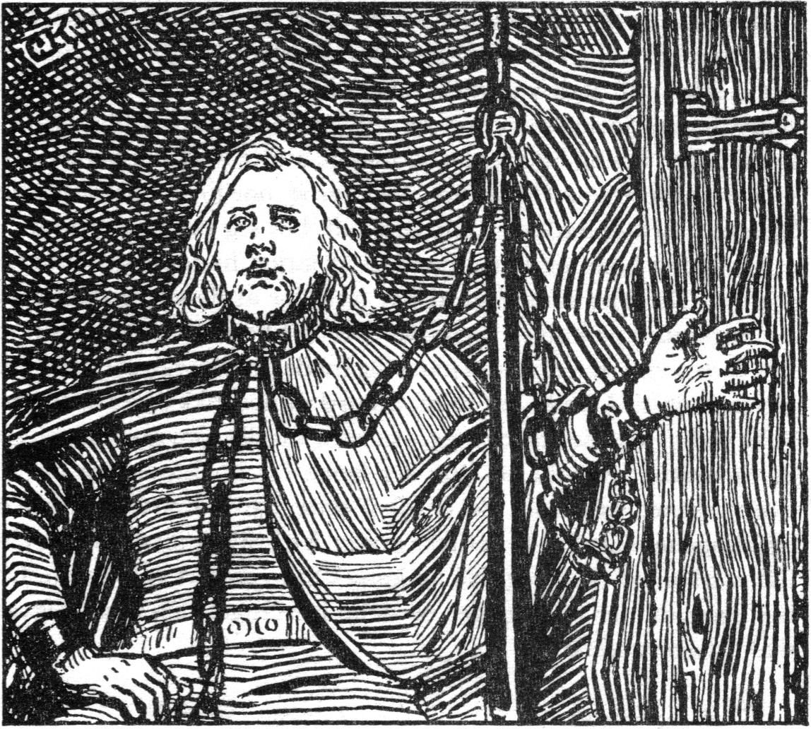
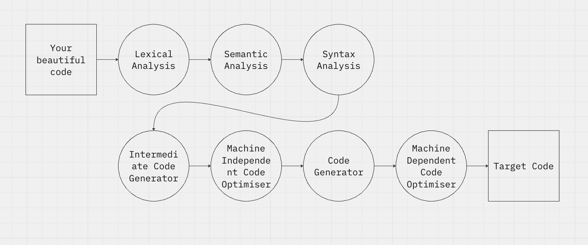

> A skald was a Norse poet or bard who composed and recited verses celebrating heroes and Norse gods. They used complex forms and wordplay, playing a key role in preserving Viking history, mythology, and culture.

Have you ever wanted to create your own programming language? I bet you do!
In this series of articles, we'll dive into the art of thinking, designing and implementing a programming language and its compiler.

## Introduction

Think a little about how you run your code. First, you need to write it. And I bet you write good codes!

After writing, to execute the program, you need to compile it, because your machine can't just understant what you wrote in human language.

The compiler is nothing more than a big (big) program that reads your code and translates it into a code your computer understands.

> Interpreter vs Compiler <br/>
> Actually, you can also *interpret* your code, as with Python or Node.js. But think in a compiler as just as a program that translates program written in one language to another.


A compiler is divided into several parts, and the first one is the **lexical analysis**.



## Lexical analysis - Tokenization

All programming languages has a vocabulary. This vocabulary is composed by reserved words, operators, identifiers, symbols etc.

It is like our human language. We have words and we can combine them to form another words. For example, the word "abnormal" is formed by the prefix "a-" and the word "normal". Both are lexical structures of the language.

We need first to determine what lexical structures our own language will have. But these "lexical structures" are not called like that. They are called **tokens**.

Let's define a language:

### Paradigm

Here you can choose some of the following:
1. Imperative (like C, and the most easy to implement. We are going to use this one)
2. Functional (like Haskell)
3. Object-oriented (like Java)
4. Logic (like Prolog)

### Level

Low-level languages are the type of language that is more close to the processor and to the binary code. The most famous example is Assembly, that is the instruction set of the processor itself. High-level languages are the most human readable types of languages, Python, for example.

### Machine
Your code will run into a virtual machine, like Java, or directly into the hardware, like C.

### Translational type

Here you choose if your language is compiled (entirely translated to binary code) or interpreted (another program will read your code and execute it). For example,  Javascript is interpreted, because it needs a program to interpret what you wrote ( [Node.js](https://nodejs.org/en), for instance).

But C, in other hand, is compiled, because a **compiler** reads all your code and translates it to binary that runs directly in your hardware ([GCC](https://gcc.gnu.org/) is one compiler of the C language).

Another famous languages are hybrid, because has the both stages, like Java ([check this article](https://www.baeldung.com/java-compiled-interpreted)).

## Starting the project

Our language, the **Skald Lang** will have some atributes of famous languages, like Pascal and Shell. The blocks will start with a word and end with it reverse. Check our Fibonacci example code:

The programming language to be implemented, is an imperative programming language without support for subroutines. The structure of a skald program consists of two sections: var and main, which respectively contain variable declarations and the statements to be executed. The var section is delimited by a block starting with var and ending with rav, and the main section by main and niam.

### Syntax and basic concepts

We do not care about identation nor line breaks (except as a terminator for a comment, which starts with the char '$')

All variables must be declared in the var block, and all the logic code will be written in the main block.

### Control structures

We have two control structures: one conditional and another is a loop.

**Conditional:**
```
if condition do
  $ true case
or
  $ false case
fi
```

**Loop:**
```
loop condition do
  $ block
pool
```

### Type system:
We have defined three types: int, real and str. Integer variables are just numbers [0-9]+.

Real variables are for "floats", like 9.1 or 3.14159. They are separated by dots.

Strings are for any sequence of characteres enclosed in double quotes. We also support escape like *\t* and *\n*.

### Operators:

The arithmetic operators ```+, -, *, /, %, and ^``` are available for int variables, representing addition, subtraction, multiplication, integer division, remainder of division, and exponentiation, respectively. For real variables, the operators ```+, -, *, /, and ^``` are available.

The relational operators ```<, <=, >, >=, =, and !=```, representing less than, less than or equal, greater than, greater than or equal, equal, and not equal, are available for int and real variables. For str variables, only ```= and !=``` are supported.

The logical operators ```&, |, and !```, representing conjunction, disjunction, and negation, respectively, are reserved for boolean expressions, which are the result of a relational operator.

The keywords in and out are used for input and output. Any variable can be read from stdin in the format in. Any variable or literal value can be displayed to stdout in the format out.
```
$ declaration block
var
    a int.
    b int.
    c int.
    counter int.
rav


$ main block
main
    a <- 1.
    b <- 1.

    in counter.
    if counter < 0 do
        out "Error \n".
        die.
    fi

    loop counter > 0 do
        out "fibonacci ".
        out a.
        out "\n"

        c <- a + b.
        a <- b.
        b <- c.
        counter <- counter - 1.

        if counter = 1 do
            out "Ending \n".
            stop.
        or
            out "Not ending \n".
        fi
    pool
niam
```

Have you noticed the **reserved words?**. These words are reserved for our language, and the programmer cannot use them to declare variables or functions.

Also, we have some symbols, like ```">", "<-" and "."```. These symbols are also part of our syntax.

## Token table

| **Meaning**            | Token                           |
| ---------------------- | ------------------------------- |
| String                 | `str (ascii \0)`                |
| Real Number            | `real (float64)`                |
| Integer                | `int (int64)`                   |
| **Program Structure**  |                                 |
| Variable Declaration   | `var`                           |
| Reverse Declaration    | `rav`                           |
| Main Function          | `main`                          |
| Reverse Main Function  | `niam`                          |
| Loop                   | `loop`                          |
| Reverse Loop           | `pool`                          |
| If                     | `if`                            |
| Or                     | `or`                            |
| End If                 | `fi`                            |
| Stop                   | `stop`                          |
| Die (exit)             | `die`                           |
| Input                  | `in`                            |
| Output                 | `out`                           |
| End of Declaration     | `.`                             |
| Comment Start          | `$`                             |
| **Rules**              |                                 |
| No braces              | No braces                       |
| Use `do`               | Use `do`                        |
| No parentheses in `if` | No parentheses in conditionals  |
| **Operations**         |                                 |
| Assignment             | `<-`                            |
| Arithmetic             | `+`, `-`, `*`, `/`, `%`, `ˆ`    |
| Logic                  |  `!`, `&`, `|`                  |
| Relational             | `<`, `<=`, `>=`, `>`, `=`, `!=` |

Now, with our token table, we can read byte to byte a source code and check it the token is in our definition. If so, our code is syntactically correct. If not, we need to log the error to our program.

## Hands-on: A C++ code.

But, how do we effectively write the lexer? Me and my coworker wrote in C++, and to help us, we defined an **enum** to all tokens:

```
enum TokenKind {
    Tok_Var,
    Tok_Rav,
    Tok_Main,
    Tok_Niam,
    Tok_Loop,
    Tok_Pool,
    Tok_If,
    Tok_Or,
    Tok_Fi,
    Tok_Do,
    Tok_In,
    Tok_Out,
    Tok_Stop,
    Tok_Die,
    Tok_Int,
    Tok_Real,
    Tok_Str,
    Tok_Ident,
    Tok_Assign,
    Tok_OpMul,
    Tok_OpSum,
    Tok_OpAnd,
    Tok_OpOr,
    Tok_OpNot,
    Tok_OpRel,
    Tok_ParOpen,
    Tok_ParClose,
    Tok_Period,
    Tok_LitStr,
    Tok_LitReal,
    Tok_LitInt,
};
```

And also for the operators:
```
enum OpArit {
    Op_Add,
    Op_Sub,
    Op_Mul,
    Op_Div,
    Op_Mod,
    Op_Pow,
};

enum OpRel {
    Op_Less,
    Op_LessEq,
    Op_Greater,
    Op_GreaterEq,
    Op_Eq,
    Op_Neq,
};
```

Then, we need to iterate over every byte of our source file and check if it is a valid token. To do this, we used a **state machine**:
```

enum LexState {
    State_Start,
    State_IdentKw,
    State_Int,
    State_Real,
    State_Symbol,
    State_Comment,
    State_Str,
};
```

And the logic is very simple: reading a reserved word, a comment, a symbol correctly, we return a Token. If not, we return the error and the line that the error occurred.

## Big example

How to calculate the Euler number?
The calculation of the approximation of *e* (Euler's number) by the sum can be expressed as:

$$
e^x \approx 1 + x + \frac{x^2}{2!} + \frac{x^3}{3!} + \dots
$$

This is the series expansion (Taylor series) of \( e^x \), where \( x \) is the value for which you want to approximate \( e^x \). The summation continues indefinitely, but for practical purposes, it's truncated after a certain number of terms.

In mathematical notation:

$$
e^x = \sum_{k=0}^{\infty} \frac{x^k}{k!}
$$

Where \( k! \) is the factorial of \( k \), and the terms grow as powers of \( x \) divided by the factorial of their corresponding indices.
```
var
  max_iter int.
  iter int.
  iterf real. factorial real. x real.
  xpow real.
  y real.
rav

main
  out "x: ". in x.
  out "\n".
  out "iteration: ". in max_iter.
  out "\n".
  if max_iter < 0 do
    out "Iteration number must be positive".
    die.
  fi
  iter <- 0.
  iterf <- 1,0. factorial <- 1,0. xpow <- 1,0.
  y <- 1,0.
  loop iter < max_iter do
    y <- y + (xpow / factorial).
    xpow <- xpow * x.
    factorial <- factorial * iterf.
    iter <- iter + 1.
    iterf <- iterf + 1,0.
  pool
  out "exp(". out x.
  out ") = ". out y.
  out "\n".
niam

```


## Conclusion

This is the very first step, the simplest one: **the lexer**. We just generate an array of tokens. This array will be used later in our syntax analyzer and in the semantic analyzer.
Thanks for reading!

[Check the repo here!](https://github.com/Felipalds/skald)
