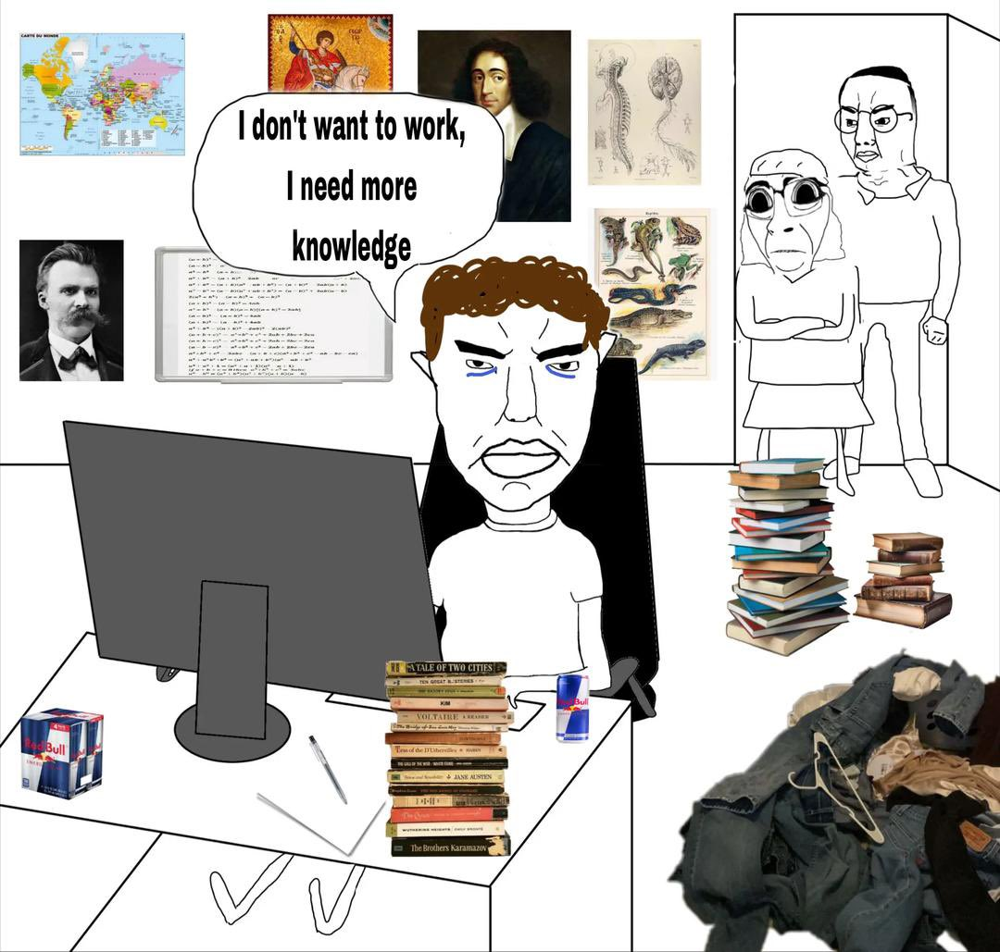

Recently I've been thinking about something that's been happening to me and I am sure that it happens to many people - perhaps even you, if you clicked on this blog. When I was a child, I was one of the best students in my class. I got good grades without even studying too much. I remembered everything I watched, everything I did and everything I heard.

But lately I was finding hard even to remember the last episodes of the anime I was watching and what happened on the last movie I saw. And this problem was even bigger: I couldn't remember what I learned the day before and started to not concentrate even on my code.

This was upseting me a lot, I didn't know what to do anymore. I opened my editor (neovim btw), stared at the screen, and couldn't write a single line of code. Was it sleep? Maybe not, I slept fine last night. Then I drank coffee. Mugs and mugs of coffee. And it didn't resolve anything (only increased my anxiety). What was happening to me?

So I watched one video from a guy called Arata, a bitcoiner guy from Brazil who has a channel about productivity and mindfullness:  [Stop listening to Youtube while doing other things.](https://www.youtube.com/watch?v=tIRQDQhEuJY) This really made sense to me. I was just **running away from tedium**, doing hundreds of things at the same time. I was not paying attention to my life, to what I was doing **now**. I was trying to escape the reality with the illusion of being more productive.

## 1. The lie about the super productivity

Do not try to optimize 100% of your time trying to be productive, listening to podcasts while you clean your house, watching videos while you cook or things like this. You are just trying to run away from reality with easy content. Listen to things while doing other things even a monkey does. You are more than that. Do the things the best way you can, give your maximum on every activity, and do not try to do 100 things at the same time with the false premise of "being productive" and "saving time". Do you want to save your time? Stop watching to **fcking** TikTok or Reels. Just be intentional on what you do.

This is also the reason why I am thinking that having two monitors is also bad for productivity. You can argue that you are more productive with two monitors but I just think we cannot focus on more then two things at the same time. The second monitor is just a quick distraction, and if you do not pay attention, you will end with some random video/social media running on it.

## 2. Be intentional on what you do (and do only one thing at a time)

If you are eating, **eat**, without watching to Youtube. If you are cooking, **cook**. If you are coding, **code**. Probably the first 5 minutes will be stressfull and boring, but trust me, get in the flow. You received a Slack/e-mail notification? Good. Finish what you have to do and then read it. Even if you feel unmotivated or if you want to check Twitter notifications, do not do it now. You can, but later. First you code. Then later you find time to read to Twitter - and do only this too.

One thing you can do to improve this is just going for a walk. Without phones, musics, podcasts or noise. Just 10 minutes of your morning time, walk and pay attention to your surroundings. I think code thinking at loud can help you to focus more. Talk about what are you thinking and about your own logic.

One tip from ThePrimagen on [this video](https://youtu.be/T8ZKo8Wa7hw?si=eS6efLqZjwT4555L&utm_source=ZTQxO) is to watch to your code being builded or your pipeline running, without checking Twitter. This is hard as fck, but it will help you on long terms. During this time, you can think about everything, like a garbage collector!!! (Going to bathroom without your phone has the same idea!).  

## 3. Start producing

I've watched also a [YouTube video about the parasite manifest](https://www.youtube.com/watch?v=nX0wPjNzn3o): you need to stop consuming content and start producing content! You need to share **your thoughts** and not just watch others one. You need to share your knowledge, teach others about what you already know. This can help you to stop consuming so much content and enhance your focus. This inclusive can help you to learn better, but I will write a blog post about this other time.

Also, if you just consume things, you are a just a parasite who only use things from others, you need to start CREATE things, share and produce! When you only consume, you can have a "mental obesity", when you have so much content in your head and do not use any of it.

This is not only related to share content, but producing real value to society, to your company and community.
Want some tips for this one? Why don't you solve some Open Source issue or share something you know on Twitter? Tag me there! (@felipalds)

## Do what you need to do now - and only this.

So, TLDR is just do one thing at time, try not to overload your mind with tons of contents and examine your thoughts. Then, start producing, helping your team and society.
What do you think? Agree with me? Please share your comments on my Linkedin or Twitter! See you next time.

References:
- Stop listening to Youtube while doing other things: https://www.youtube.com/watch?v=tIRQDQhEuJY
- Anti-parasite manifest: https://www.youtube.com/watch?v=nX0wPjNzn3o
- How To Find Time To Learn After Work: https://youtu.be/T8ZKo8Wa7hw?si=eS6efLqZjwT4555L&utm_source=ZTQxO

